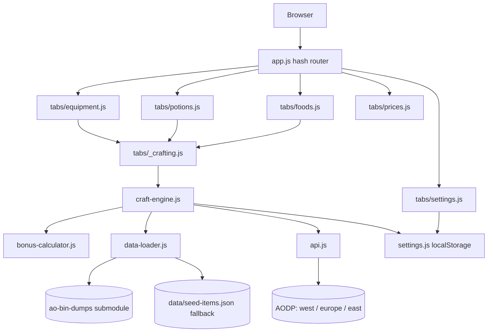

# Architecture

Moonlit Lily is a fully static site that runs entirely in the browser and is served by GitHub
Pages. There is no backend, no server-side rendering, and no build step. All computation
happens on the client. Live market data is pulled from the Albion Online Data Project (AODP)
public API and the item / recipe catalog comes from the `ao-bin-dumps` git submodule.

## Component overview

## Runtime flow

1. `index.html` bootstraps `js/app.js`, which reads the URL hash and activates a tab.
2. Each crafting tab (Equipment / Potions / Foods) is a thin wrapper over `js/tabs/_crafting.js`,
   which builds the UI, wires bonus controls, and delegates math to the craft engine.
3. `data-loader.js` fetches `ao-bin-dumps/formatted/items.json` at runtime. If unreachable, it
   falls back to `data/seed-items.json` so the app is still demoable offline.
4. `api.js` calls AODP using the server subdomain resolved from settings
   (`america` -> `west.albion-online-data.com`, `europe` -> `europe.albion-online-data.com`,
   `asia` -> `east.albion-online-data.com`).
5. `craft-engine.js` builds a `RecipeView` from the catalog, optionally autofills market
   prices, and calls `bonus-calculator.js` for RRR + batch-aware output + profit metrics.

## Non-functional constraints

- **Static only**: everything under repo root is servable as-is by GitHub Pages.
- **No build step**: pure ES modules loaded via `<script type="module">`.
- **Submodule size**: `ao-bin-dumps` is added shallow (`shallow = true` in `.gitmodules`).
  The workflow uses `--depth 1` and `submodule.recurse` is not required.
- **CORS**: AODP allows cross-origin requests, so no proxy is needed.
- **Caching**: price responses are memoized in-memory with a TTL from settings (default 15 min);
  the catalog is memoized for the page lifetime.

## Deployment

`.github/workflows/update-data.yml` runs weekly (Sunday 00:00 UTC) and on manual dispatch. It
updates the `ao-bin-dumps` submodule, commits when there are changes, then publishes the repo
root as a GitHub Pages deployment via `actions/deploy-pages@v4`.
